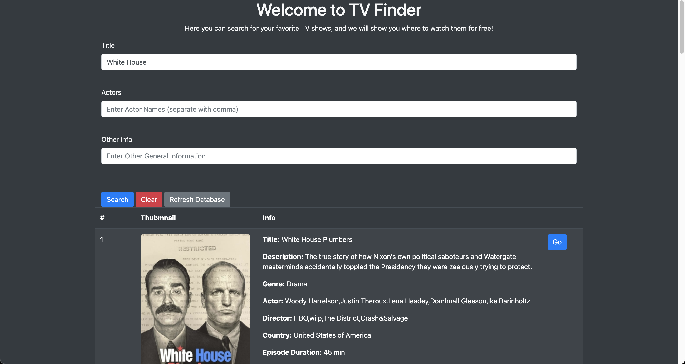

The web app is mainly created with the Flask Python library. 
Flask allows us to create responsive web app using no Javascript at all. And it is much more efficient in html rendering and deployment. We can also run Python functions without the need of setting up a cloud server.

Once you have everything downloaded, from the root directory, run `python main.py` in the terminal.
In your terminal, you will see a message `Running on http://127.0.0.1:5000`, open this link in your browser, and you will be able to access the website. 

